# Smart Travel and Route Planner

A website that finds walking routes across a college campus and shows the graph search as it happens. Every data structure behind it is written by hand: **array, linked list, stack, queue, two trees, graph and hash table**, plus searching and sorting.

[](https://shivam-pandyacoder24.github.io/Smart-Travel-and-Route-Planner/)
[](https://github.com/shivam-pandyacoder24/Smart-Travel-and-Route-Planner/actions/workflows/tests.yml)


[](LICENSE)

**Live demo: https://shivam-pandyacoder24.github.io/Smart-Travel-and-Route-Planner/**

> **Try it in 10 seconds:** open the live demo and click **Find route**. It starts with *Central Library* to *CSE Block* filled in.
> Then scroll down to **Inside the planner** to see what each data structure is holding.

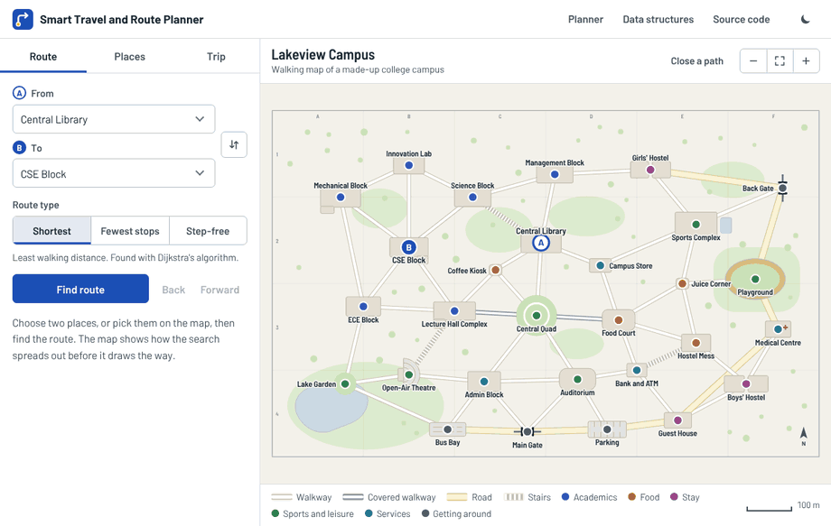

## Contents

- [Features](#features)
- [Data structures and where each one is used](#data-structures-and-where-each-one-is-used)
- [Engineering highlights](#engineering-highlights)
- [How it works](#how-it-works)
- [Screenshots](#screenshots)
- [Run it on your computer](#run-it-on-your-computer)
- [Put it online with GitHub Pages](#put-it-online-with-github-pages)
- [Use your own campus](#use-your-own-campus)
- [What I'd build next](#what-id-build-next)

## Features

**Find a route**
- Pick a start and a destination by typing, from a list, or by choosing places on the map
- Three route types: **Shortest**, **Fewest stops** and **Step-free** (no stairs)
- Watch the search spread across the map, then pause it, step through it or drag it backwards
- Step-by-step directions with compass headings, distances and walking times
- **Close a path** (say, for construction) and the route goes around it
- Back and Forward buttons for your route history, and a link you can share

**Explore places**
- Search by name, ID or what you need ("coffee", "hostel", "swimming")
- Filter by category, or by what is within a 2, 5 or 10 minute walk
- Sort by name, category or walking distance, with the sorting algorithm of your choice

**Plan a trip**
- Save several stops in order and get one route through all of them
- Reorder, remove or reverse the stops; **Shorten trip** reorders them to cut walking
- Your trip is remembered the next time you open the site

**See inside**
- A live view of every data structure: the hash table's buckets, both trees, the linked list, the stacks, the queue and heap at each step of a search
- An activity log of what each structure just did

It also has a dark map, works on phones, and can be used with the keyboard alone.

## Data structures and where each one is used

| Topic | What it does here | Try it on the site | Code |
|---|---|---|---|
| **Arrays** | All 29 places are stored in one array of records. A place's position is also its vertex number in the graph. | *Inside the planner → Arrays* | [`src/data/campus.js`](src/data/campus.js) |
| **Searching** | **Linear search** for "Search places". **Binary search** finds where "within a 5 minute walk" ends in a sorted list of distances. | *Places* tab, search box and *Within* | [`src/dsa/search.js`](src/dsa/search.js) |
| **Sorting** | **Insertion**, **merge** and **quick** sort order the destinations. The site counts each one's comparisons. | *Places* tab, *Sort by* and *Sort with* | [`src/dsa/sorting.js`](src/dsa/sorting.js) |
| **Linked list** | The saved trip is a **doubly linked list** of stops. | *Trip* tab | [`src/dsa/linked-list.js`](src/dsa/linked-list.js) |
| **Stack** | Two stacks drive **Back** and **Forward**. A stack also reverses the search result into walking order (backtracking), and runs depth-first search. | *Back* and *Forward* buttons | [`src/dsa/stack.js`](src/dsa/stack.js) |
| **Queue** | A circular-array queue drives **breadth-first search** for the *Fewest stops* route. | *Fewest stops*, then watch the queue under the map | [`src/dsa/queue.js`](src/dsa/queue.js) |
| **Tree 1** | A **general tree** of categories: Campus → Academics → Departments → CSE Block. | *Places* tab, category chips | [`src/dsa/category-tree.js`](src/dsa/category-tree.js) |
| **Tree 2** | A **binary search tree** indexes every word in a place name, so typing "lib" or "block" finds matches without reading every name. | Type in *From* or *To* | [`src/dsa/bst.js`](src/dsa/bst.js) |
| **Graph** | Places are vertices and paths are weighted edges, kept in an **adjacency list**. **Dijkstra**, **BFS** and **DFS** run on it. | The map itself | [`src/dsa/graph.js`](src/dsa/graph.js) |
| **Hashing** | A **hash table with chaining** turns a location ID such as `LIB` into its record in one step. | *Inside the planner → Hashing* | [`src/dsa/hash-table.js`](src/dsa/hash-table.js) |
| Min-heap | The priority queue that makes Dijkstra's algorithm fast. | *Shortest*, then watch the heap under the map | [`src/dsa/min-heap.js`](src/dsa/min-heap.js) |

A longer explanation of each one, with the questions an examiner is likely to ask, is in **[docs/HOW_IT_WORKS.md](docs/HOW_IT_WORKS.md)**.

## Engineering highlights

- **Every structure is hand-written.** The files in [`src/dsa/`](src/dsa) use plain arrays and objects only: no built-in `Map`, `Set`, `sort` or `indexOf`.
- **Three algorithms, one map.** The same two places can give different routes:

  | Route type | Algorithm | Central Library → CSE Block | Girls' Hostel → Guest House |
  |---|---|---|---|
  | Shortest | Dijkstra with a min-heap | 365 m, using Science Steps | 720 m over 5 paths |
  | Fewest stops | Breadth-first search with a queue | 365 m | 930 m over 4 paths |
  | Step-free | Dijkstra with stairs switched off | 425 m, via Coffee Kiosk | 725 m |

- **The search animation is real.** Each search records every step it takes. The map replays those steps, so you can drag the slider backwards and see the exact queue or heap at that moment.
- **The routing code never touches the page.** [`src/planner.js`](src/planner.js) has no browser code in it, so the same file runs on the site and in the tests.
- **67 automated tests** cover every structure and feature. One test checks all 406 pairs of places in all three route types. They run on every push with GitHub Actions.
- **No dependencies and no build step.** Plain HTML, CSS and JavaScript modules. The fonts are bundled, so the site works without an internet connection.
- **Accessible:** every place on the map can be reached and opened from the keyboard, focus is always visible, and animations are skipped for people who ask their device to reduce motion.

## How it works

### Architecture

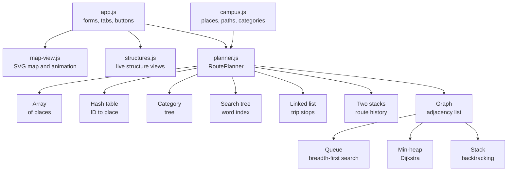

When the page loads, `RoutePlanner` reads the campus data once and fills every structure. After that, each feature asks the structure that suits it.

### What happens when you click Find route

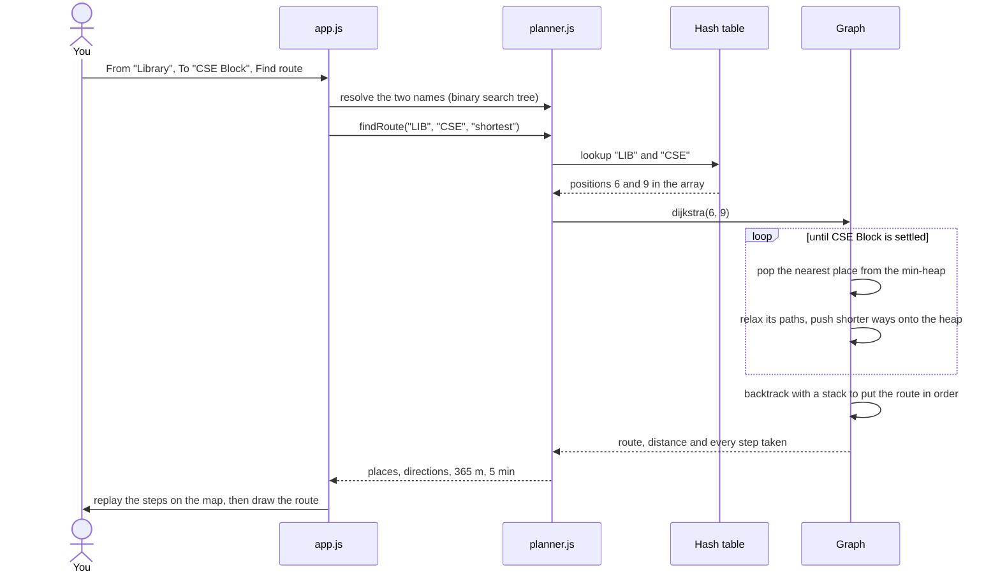

### Where to find things in the code

| To understand… | Look at |
|---|---|
| The campus: places, paths, categories | [`src/data/campus.js`](src/data/campus.js) |
| How the structures are filled and used together | [`src/planner.js`](src/planner.js) |
| Each data structure and algorithm | [`src/dsa/`](src/dsa) |
| The map, zooming and the route animation | [`src/ui/map-view.js`](src/ui/map-view.js) |
| The From and To boxes with suggestions | [`src/ui/place-picker.js`](src/ui/place-picker.js) |
| The "Inside the planner" views | [`src/ui/structures.js`](src/ui/structures.js) |
| Buttons, tabs and everything that ties the page together | [`src/ui/app.js`](src/ui/app.js) |
| Colours, type and layout | [`assets/style.css`](assets/style.css) |
| Tests | [`tests/`](tests) |

## Screenshots

| The search in progress | The route |
|---|---|
| 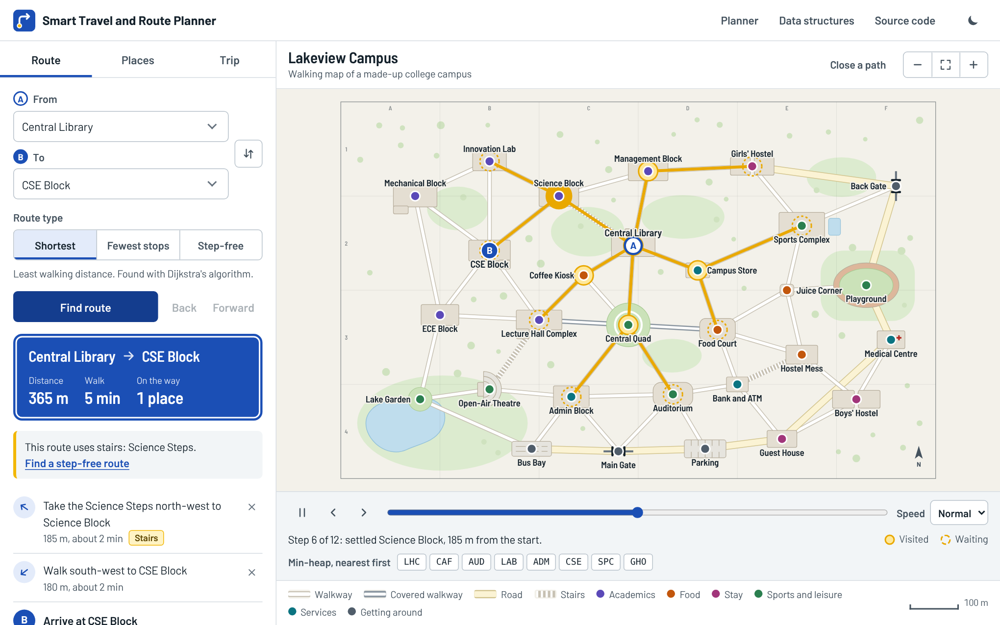 | 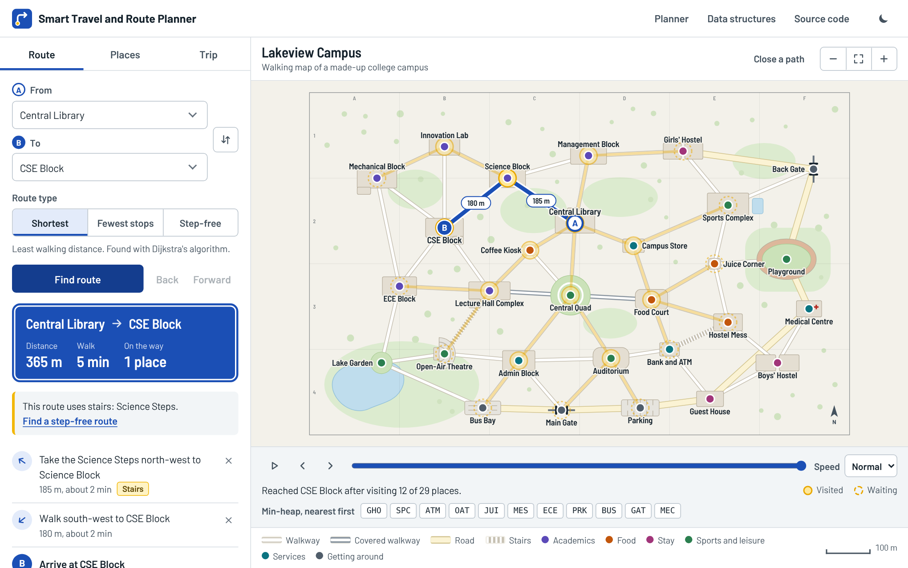 |

| A multi-stop trip | Places near the library |
|---|---|
| 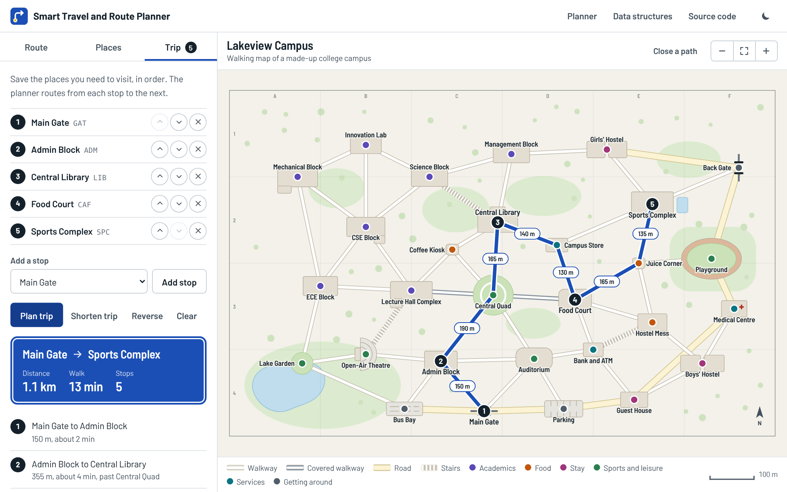 | 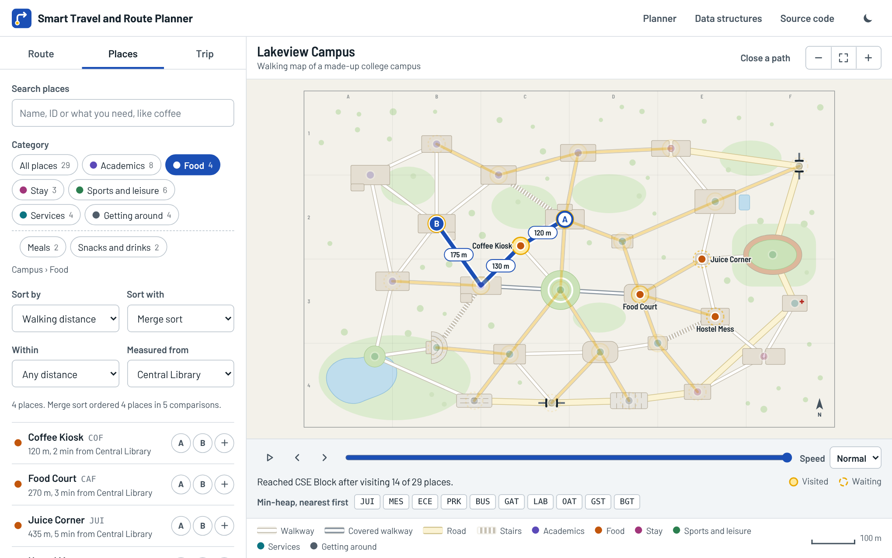 |

| Hash table | Queue during breadth-first search |
|---|---|
| 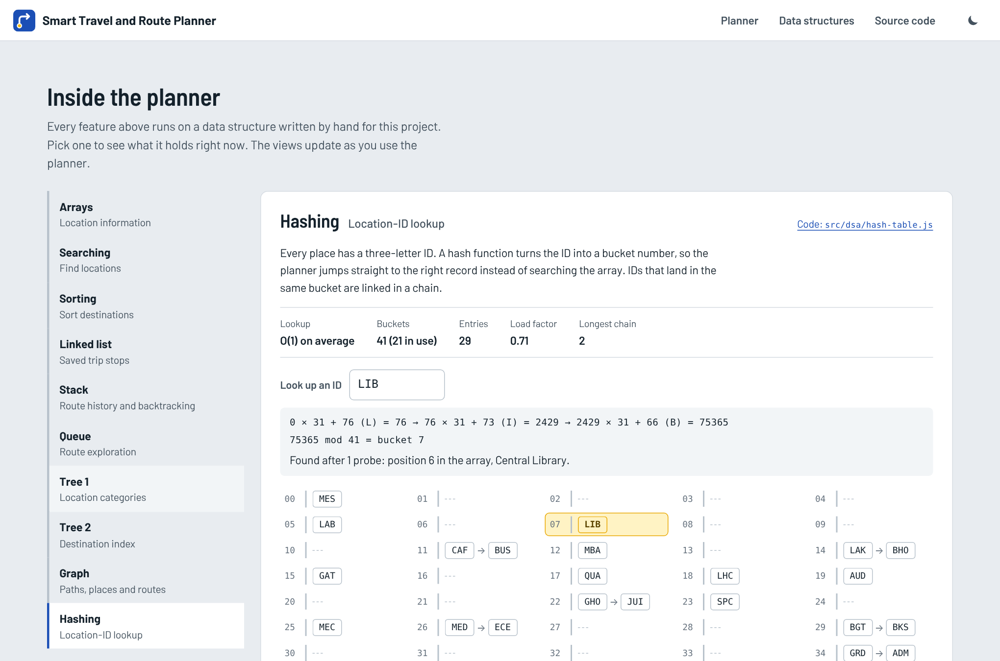 | 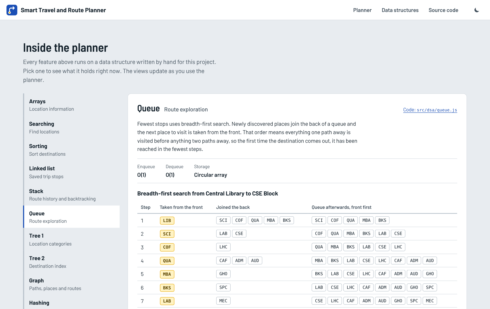 |

| Binary search tree | Category tree |
|---|---|
| 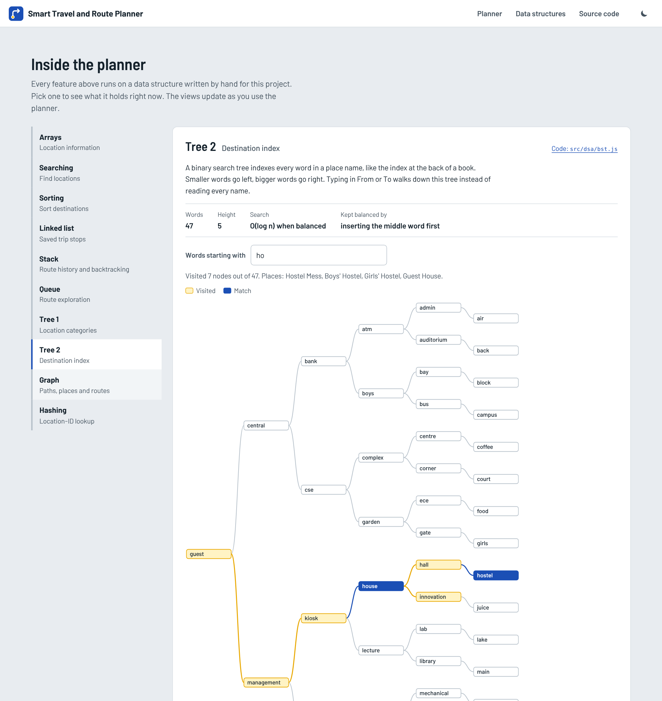 | 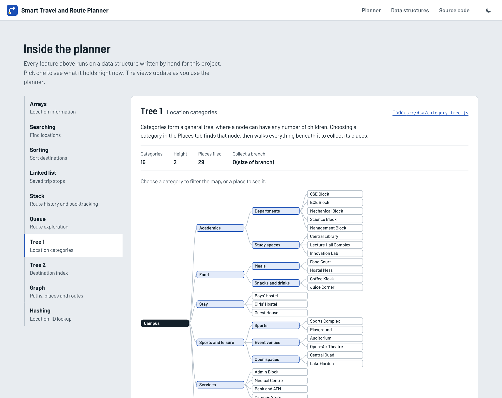 |

| Dark map | On a phone |
|---|---|
| 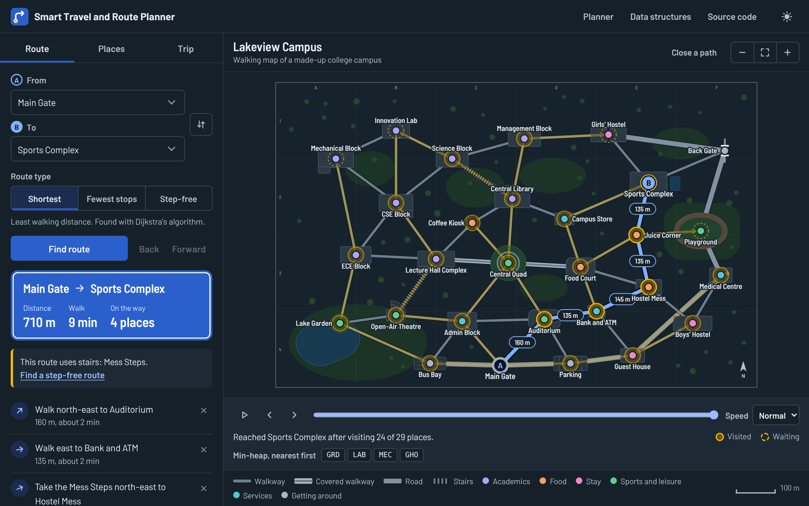 | 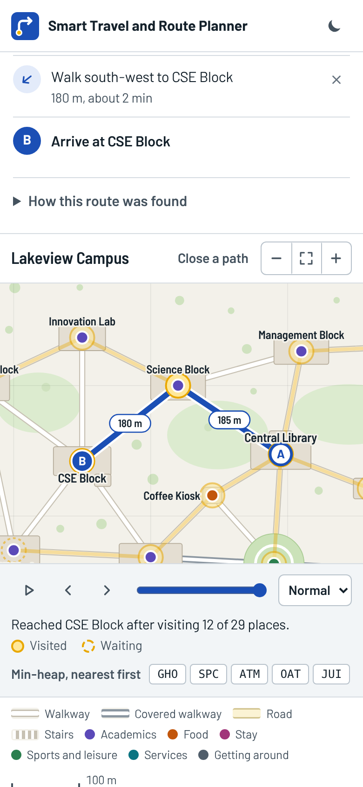 |

## Run it on your computer

The site is plain files, but browsers only load JavaScript modules from a web server, so opening `index.html` by double-clicking will not work. Any small server will do. With Python:

```bash
git clone https://github.com/shivam-pandyacoder24/Smart-Travel-and-Route-Planner.git
cd Smart-Travel-and-Route-Planner
python -m http.server 8000
```

Open http://localhost:8000 and keep that terminal open while you use it. On Windows, type `py` instead of `python` if `python` isn't recognised.

Run the tests (needs [Node.js](https://nodejs.org) 20 or newer, nothing to install):

```bash
node --test
```

## Put it online with GitHub Pages

GitHub hosts the site for free, straight from this repository.

1. Open the repository on GitHub and go to **Settings → Pages**.
2. Under **Build and deployment**, set **Source** to **Deploy from a branch**.
3. Choose the **main** branch and the **/ (root)** folder, then **Save**.
4. Wait about a minute and refresh. The page shows your link: `https://YOUR-USERNAME.github.io/Smart-Travel-and-Route-Planner/`.

Every push to `main` republishes the site.

## Use your own campus

Everything about the campus is in [`src/data/campus.js`](src/data/campus.js):

- `LOCATIONS`: one record per place, with an ID, a name, a category and its position on the map in metres
- `PATHS`: which two places each path joins, how long it is, and whether it is a walkway, a covered walkway, a road or stairs
- `CATEGORIES`: how the places are grouped

Change those three lists and the route finder, search, index and category tree all follow. Building outlines on the map are drawn from the `BUILDINGS` list in [`src/ui/map-view.js`](src/ui/map-view.js); a place without an outline still gets its pin and label. Run `node --test` afterwards: the tests check that every path joins real places and that the campus is connected.

## What I'd build next

- A* search with a straight-line estimate, shown side by side with Dijkstra
- Turn-by-turn directions ("turn left at the Coffee Kiosk")
- Opening hours, such as the Back Gate closing at 9 pm
- A second map for city buses and metro lines
- Real coordinates from OpenStreetMap for an actual campus

## Built with

HTML, CSS, JavaScript (ES modules), SVG, the Node.js test runner, GitHub Actions and GitHub Pages. The typeface is [Barlow](https://github.com/jpt/barlow) by Jeremy Tribby, used under the [SIL Open Font License](assets/fonts/OFL.txt).

This project was built with the help of [Claude](https://claude.ai), Anthropic's AI assistant, used as a pair programmer. Commits it co-wrote are marked in the history.

## Author

**Shivam A Pandya**

[](https://www.linkedin.com/in/shivampandya2409/)
[](https://github.com/shivam-pandyacoder24)

## License

[MIT](LICENSE)
